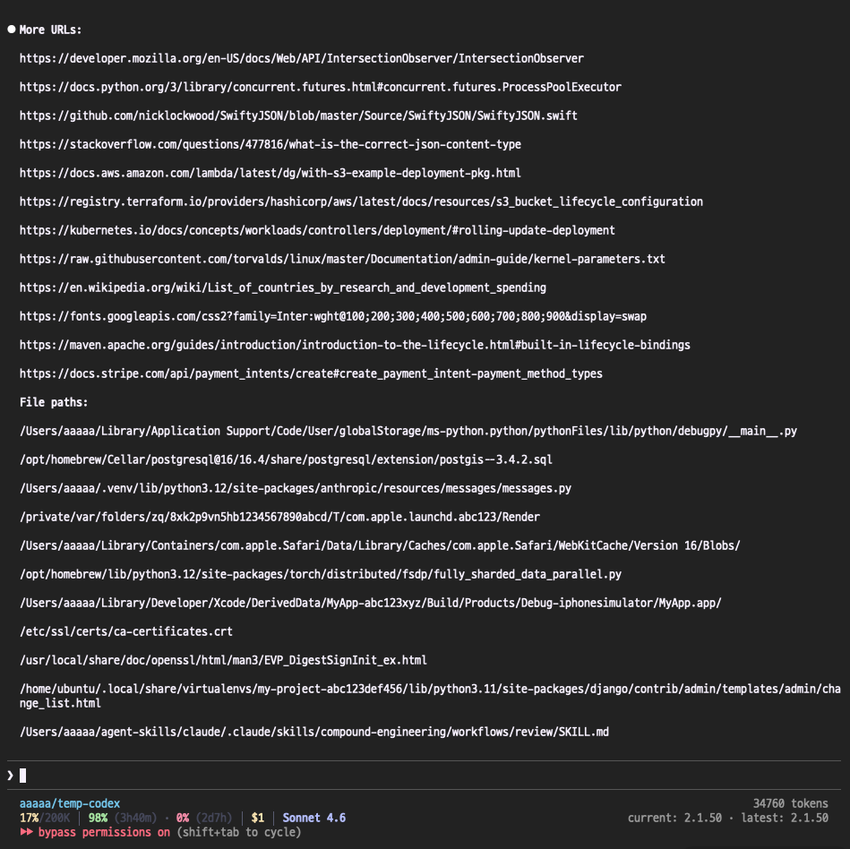
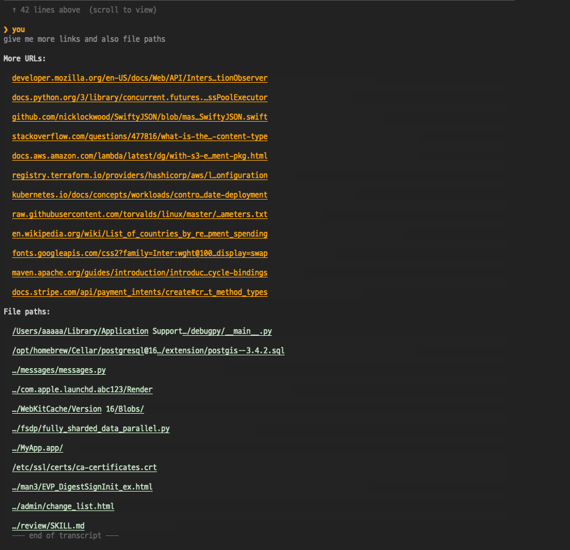

# claude-pager

A scrollable terminal pager for Claude Code session transcripts. Press **Ctrl-G** in Claude Code and your conversation history renders in the terminal while your GUI editor is open.

claude-pager solves two major Ctrl-G pain points:

- Claude Code’s TUI going blank while an external GUI editor is open
- Broken Cmd-click behavior on long wrapped links in terminal output

It does this with a native C pager + OSC-8 hyperlinks, so wrapped URLs and file paths stay clickable.

The runtime is a single compiled C binary — no Python, no Node, no runtime dependencies.

## Before vs After: clickable links and file paths

<table>
  <tr>
    <td align="center"><strong>Before</strong></td>
    <td align="center"><strong>After (claude-pager)</strong></td>
  </tr>
  <tr>
    <td></td>
    <td></td>
  </tr>
</table>

<sub>claude-pager shortens and wraps links and file paths into clickable OSC-8 hyperlinks, and keeps mouse scrolling just like regular Claude Code session context.</sub>

## Install (quick start)

### One-liner

```sh
curl -sSL https://raw.githubusercontent.com/gradigit/claude-pager/main/install.sh | bash
```

This clones the repo to `~/.claude-pager`, builds the binary, sets the `editor` in `~/.claude/settings.json`, preserves your original editor as `env.CLAUDE_PAGER_EDITOR`, and writes `env.CLAUDE_PAGER_EDITOR_TYPE` (`tui`/`gui`). No shell config changes needed.

### AI agent install

Paste `https://github.com/gradigit/claude-pager` into Claude Code or any AI coding agent. The [agent instructions](#agent-instructions) below have everything it needs to install and configure claude-pager automatically.

## ⚡ Performance

claude-pager is tuned for low-latency Ctrl-G flow, with instrumented timings from a production benchmark run (52 cycles total, 2 warmup excluded, 50 measured).

### claude-pager internal rendering timings

| Component | Median |
|---|---:|
| Claude Code exec overhead | **6.3ms** |
| claude-pager first draw | **2.7ms** |
| Terminal-ready probe | **0.04ms** |

### Ctrl-G flow timings (TurboDraft fast path)

| Metric | Median | p95 |
|---|---:|---:|
| Ctrl-G → editor window visible | **60.1ms** | **76.1ms** |
| Cmd-Q → back to Claude Code | **53.1ms** | **61.3ms** |

These Ctrl-G flow timings are measured with TurboDraft using claude-pager’s direct Unix-socket fast path. Other popular GUI editors go through the generic launch/wait path and typically do **not** hit sub-100ms Ctrl-G end-to-end flow timings.

claude-pager itself is extremely fast; most remaining end-to-end latency is outside claude-pager (external editor + window rendering path).

## ✨ Speed-of-thought editing with TurboDraft

If you want the lowest-latency prompt editing feel, use **[TurboDraft](https://github.com/gradigit/turbodraft)** (the sister tool) with claude-pager.

- claude-pager: fast transcript context + Ctrl-G flow
- TurboDraft: near-instant editing experience once the editor is open

## Features

- Keeps your terminal transcript visible while GUI editors are open (no blank Ctrl-G screen)
- Scrollable viewport with mouse wheel and keyboard navigation
- Markdown rendering: headings, bold, inline code, code blocks, lists
- Diff coloring (+green / -red / @@cyan)
- Context usage bar showing token consumption
- Live-follow mode: content updates as the transcript grows
- OSC-8 hyperlink rendering so long wrapped links remain Cmd-clickable
- OSC-8 file/path hyperlink rendering so local paths are easy to open
- Terminal resize support (SIGWINCH)
- Works with any GUI editor (TurboDraft, VS Code, Sublime, etc.)
- TurboDraft fast path: talks directly to TurboDraft's Unix socket, bypassing all shell overhead

## Requirements

- macOS (arm64 or x86_64)
- A C compiler (Xcode Command Line Tools: `xcode-select --install`)
- `jq` (installed automatically via Homebrew if missing)

## Build from source (manual)

```sh
git clone https://github.com/gradigit/claude-pager.git
cd claude-pager/bin
make
```

This produces `bin/claude-pager-open` (~70KB, zero dependencies).

## Setup

The installer handles everything automatically. If you installed manually:

### 1. Set the editor in settings.json

Add to `~/.claude/settings.json`:

```json
{
  "editor": "/path/to/claude-pager-open",
  "env": {
    "CLAUDE_PAGER_EDITOR": "code --wait",
    "CLAUDE_PAGER_EDITOR_TYPE": "gui"
  }
}
```

Claude Code sets `editor` as the binary it spawns on Ctrl-G. Since `env` values may not be exported to the editor process, claude-pager reads `~/.claude/settings.json` directly for `env.CLAUDE_PAGER_EDITOR` and `env.CLAUDE_PAGER_EDITOR_TYPE`.

### 2. Install the session hook

The included hook ensures the pager finds the correct transcript, even with multiple Claude sessions.

Add to `~/.claude/settings.json`:

```json
{
  "hooks": {
    "SessionStart": [
      {
        "type": "command",
        "command": "/path/to/claude-pager/shim/save-session-transcript.sh"
      }
    ]
  }
}
```

Without this hook, the pager falls back to finding the most recent transcript in your project directory.

## Switching Editors

Your editor is stored in `env.CLAUDE_PAGER_EDITOR` in `~/.claude/settings.json`. Change it to switch editors:

```json
{
  "env": {
    "CLAUDE_PAGER_EDITOR": "cursor --wait",
    "CLAUDE_PAGER_EDITOR_TYPE": "gui"
  }
}
```

Common values:

| Editor | Value |
|---|---|
| VS Code | `code --wait` |
| Cursor | `cursor --wait` |
| Zed | `zed --wait` |
| Sublime Text | `subl --wait` |
| Vim | `vim` |
| Neovim | `nvim` |

The resolution order is: `CLAUDE_PAGER_EDITOR` (env or settings.json) → `VISUAL` → `EDITOR` → system default (`open -W -t`).

TUI editors (vim, nvim, emacs, nano, etc.) are exec'd directly without the pager. GUI editors are forked with the pager running alongside.

You can force the path with `CLAUDE_PAGER_EDITOR_TYPE=tui` or `CLAUDE_PAGER_EDITOR_TYPE=gui` in the `env` section (read from env or settings.json).

## Key Bindings

| Key | Action |
|---|---|
| Scroll wheel | Scroll up/down |
| Arrow Up/Down | Scroll one line |
| Page Up/Down | Scroll one page |
| Home | Jump to top |
| End | Jump to bottom |
| q | Quit pager |

## How It Works

When you press Ctrl-G in Claude Code:

1. Claude Code opens an alt screen and spawns the editor shim
2. The C binary finds your session transcript via a tty-keyed temp file (~0.1ms)
3. If TurboDraft is available: connects to its socket and sends `session.open` (~0.02ms)
4. It forks and renders the pager directly in C (~3ms for pre-render, ~5ms for full transcript)
5. Your editor opens the file — the pager is already visible
6. On close: the binary detects the editor exited, kills the pager, and returns control to Claude Code

The pager uses alternate scroll mode (`\033[?1007h`) instead of mouse tracking, so OSC-8 hyperlinks remain Cmd+clickable.

## Architecture

```
claude-pager-open (C binary, ~70KB)
├── Editor resolution (CLAUDE_PAGER_EDITOR from env/settings.json → VISUAL → EDITOR → system default)
├── TUI detection (known TUI list + optional CLAUDE_PAGER_EDITOR_TYPE override + optimistic unknown-editor probe)
├── TurboDraft socket client (JSON-RPC 2.0 over Unix domain socket)
├── Generic editor path (fork editor + fork pager + waitpid)
├── Transcript parser (minimal JSON scanner, single-pass JSONL)
├── Markdown renderer (ANSI escape codes)
├── Scrollable viewport (raw terminal mode, keyboard/mouse input)
└── Recursion guard (_CLAUDE_PAGER_ACTIVE env var)
```

## Agent Instructions

This section is for AI coding agents (Claude Code, Cursor, Copilot, etc.). Everything here is deterministic — no user input is needed.

### 1. Check prerequisites

```sh
# macOS required; ensure a C compiler is available
xcode-select -p >/dev/null 2>&1 || xcode-select --install
# jq required for settings.json manipulation
command -v jq >/dev/null 2>&1 || brew install jq
```

### 2. Clone and build

```sh
git clone https://github.com/gradigit/claude-pager.git ~/.claude-pager
make -C ~/.claude-pager/bin
# verify binary exists
test -x ~/.claude-pager/bin/claude-pager-open
```

### 3. Configure settings.json

Read `~/.claude/settings.json` (create with `{}` if missing). Use `jq` to:

1. Save the current `editor` value as `env.CLAUDE_PAGER_EDITOR` (if it exists and isn't already claude-pager)
2. Set `editor` to the binary path
3. Infer `env.CLAUDE_PAGER_EDITOR_TYPE` (`tui` or `gui`)
4. Add the session hook

```sh
BINARY="$HOME/.claude-pager/bin/claude-pager-open"
HOOK="$HOME/.claude-pager/shim/save-session-transcript.sh"
SETTINGS="$HOME/.claude/settings.json"

mkdir -p "$(dirname "$SETTINGS")"
[[ -f "$SETTINGS" ]] || echo '{}' > "$SETTINGS"

# Preserve old editor
OLD=$(jq -r '.editor // empty' "$SETTINGS")
if [[ -n "$OLD" && "$OLD" != *"claude-pager"* ]]; then
    jq --arg ed "$OLD" '.env.CLAUDE_PAGER_EDITOR = $ed' "$SETTINGS" > "$SETTINGS.tmp" && mv "$SETTINGS.tmp" "$SETTINGS"
fi

# If no editor was preserved and none detected, find one
if [[ -z "$(jq -r '.env.CLAUDE_PAGER_EDITOR // empty' "$SETTINGS")" ]]; then
    for cmd in cursor code zed subl; do
        if command -v "$cmd" &>/dev/null; then
            jq --arg ed "$cmd --wait" '.env.CLAUDE_PAGER_EDITOR = $ed' "$SETTINGS" > "$SETTINGS.tmp" && mv "$SETTINGS.tmp" "$SETTINGS"
            break
        fi
    done
fi

# Set editor to claude-pager-open
jq --arg bin "$BINARY" '.editor = $bin' "$SETTINGS" > "$SETTINGS.tmp" && mv "$SETTINGS.tmp" "$SETTINGS"

# Infer editor type
tok="$(jq -r '.env.CLAUDE_PAGER_EDITOR // empty' "$SETTINGS" | awk '{print $1}' | xargs basename 2>/dev/null || true)"
case "$tok" in
  vi|vim|nvim|lvim|nvi|vim.basic|vim.tiny|vim.nox|vim.gtk|vim.gtk3|emacs|nano|micro|helix|hx|kakoune|kak|joe|ed|ne|mg|jed|tilde|dte|mcedit|amp) ty="tui" ;;
  *) ty="gui" ;;
esac
if [[ -n "$tok" ]]; then
  jq --arg ty "$ty" '.env.CLAUDE_PAGER_EDITOR_TYPE = $ty' "$SETTINGS" > "$SETTINGS.tmp" && mv "$SETTINGS.tmp" "$SETTINGS"
fi

# Add session hook (if not already present)
if ! jq -e '.hooks.SessionStart[]? | select(.command | contains("save-session-transcript"))' "$SETTINGS" &>/dev/null; then
    jq --arg cmd "$HOOK" '
        .hooks.SessionStart = ((.hooks.SessionStart // []) + [{"type": "command", "command": $cmd}])
    ' "$SETTINGS" > "$SETTINGS.tmp" && mv "$SETTINGS.tmp" "$SETTINGS"
fi
```

### 4. Done

Tell the user to restart Claude Code and press **Ctrl-G**. The pager will render their conversation transcript while the editor is open.

### Agent notes

- The binary auto-detects TurboDraft's Unix socket — no special config needed for TurboDraft users
- Editor resolution: `CLAUDE_PAGER_EDITOR` (env or settings.json) → `VISUAL` → `EDITOR` → `open -W -t` (macOS default)
- `CLAUDE_PAGER_EDITOR_TYPE` is also read from env or settings.json (`tui`/`gui` override)
- The session hook enables multi-session support; without it the pager falls back to the most recent transcript in the project directory
- `_CLAUDE_PAGER_ACTIVE` env var is set internally to prevent recursion — agents do not need to set this
- No shell config changes (VISUAL/EDITOR) are needed — settings.json is the canonical configuration path

## Development

```sh
git clone https://github.com/gradigit/claude-pager.git
cd claude-pager/bin
make            # builds claude-pager-open
make clean      # removes build artifacts
```

The C source is in `bin/claude-pager-open.c` (editor resolution + socket + fork logic) and `bin/pager.c` (pager rendering).

The runtime is fully C-based: `bin/claude-pager-open.c` handles editor/session orchestration and `bin/pager.c` handles rendering.

## License

MIT
